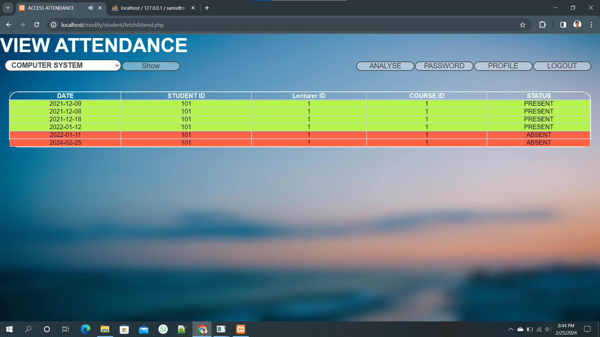

# Student Attendance Management System

## Overview
This project is a Student Attendance Management System designed to facilitate attendance tracking for students. It allows three types of users: admin, student, and lecturer, each with their respective roles and permissions.

## Features
- **Admin Dashboard**: Provides functionalities for managing students, lecturers, courses and generating reports.
- **Student Portal**: Allows students to view their attendance, percentage of attendance, and course details.
- **Lecturer Portal**: Enables lecturers to create attendance forms, mark attendance, and get course details.

## Technologies Used
- **PHP**: Backend scripting language for server-side logic.
- **MySQL**: Relational database management system for storing data.
- **HTML/CSS/JavaScript**: Frontend technologies for user interface and interactivity.
- **jQuery**: JavaScript library for simplifying client-side scripting.

## Installation
1. Clone the repository:
2. Import the SQL file (`database.sql`) into your MySQL database to create the necessary tables and initial data.
3. Update the database configuration in `config.php` with your MySQL database credentials.

## Usage
1. Access the application through a web browser.
2. Depending on your user type:
- **Admin**: Log in with admin credentials to access the admin dashboard and manage the system.
- **Student**: Log in with student credentials to view attendance records and course details.
- **Lecturer**: Log in with lecturer credentials to mark attendance, view student lists, and manage courses.

## Screenshots

 

 

 

## Contributing
Contributions are welcome! If you'd like to contribute to this project, please follow these steps:
1. Fork the repository.
2. Create a new branch (`git checkout -b feature/fooBar`).
3. Make your changes.
4. Commit your changes (`git commit -am 'Add some fooBar'`).
5. Push to the branch (`git push origin feature/fooBar`).
6. Create a new Pull Request.

## License
This project is licensed under the MIT License - see the [LICENSE](LICENSE) file for details.

## Credits
- [Nimantha Kasun](https://github.com/nimantha2000) - Lead Developer

## Acknowledgments
- [jQuery](https://jquery.com/) - JavaScript library

## Test login id's

Admin	- id=0  	psw=1234
Lecture - id=1		psw=1234
Student	- id=101	psw=1234

